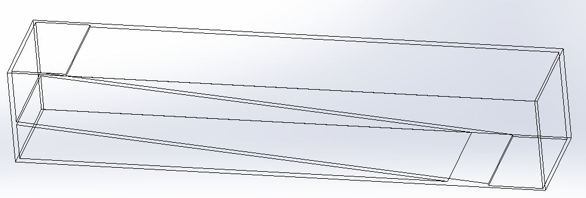
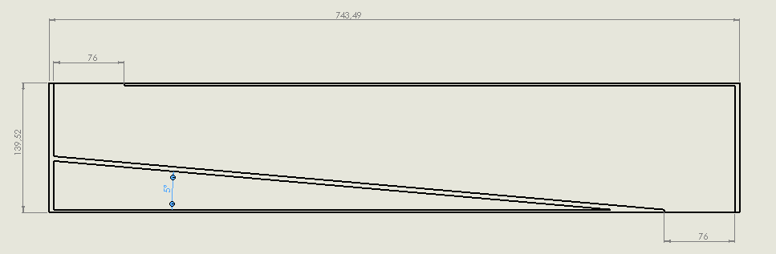
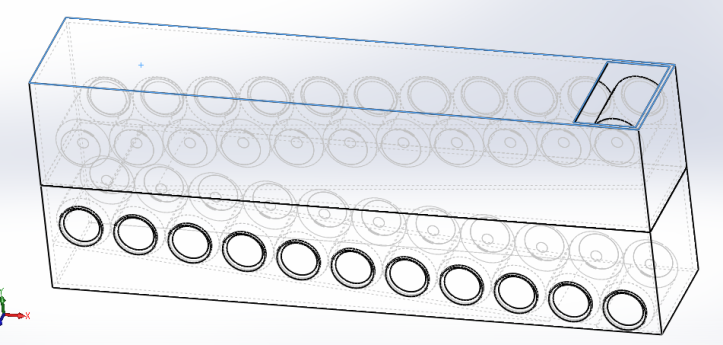
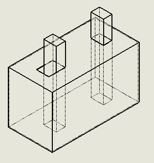
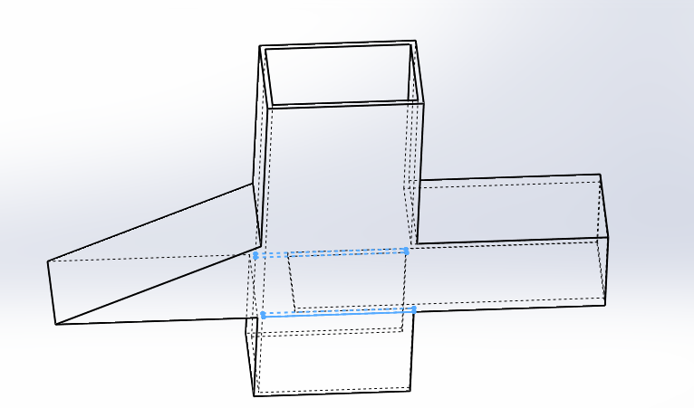
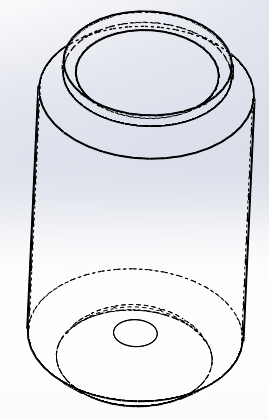
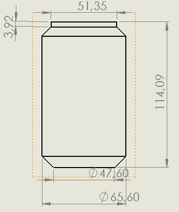
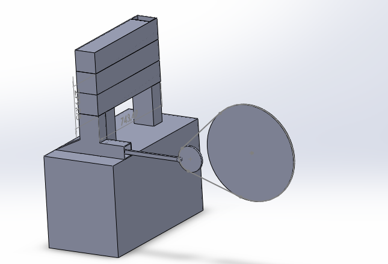

# Bike Can Compactor

## Objective

Crush cans for recycling and work-out at the same time.

## Description

This is a university project for a mechanics class during my second year.

The project was to develop an energy efficient soda can compacting machine. The device would allow user to workout while the mechanical energy of their effort was put to good use.

With my team we performed mechanical analysis of the necessary force to crush soda cans and designed the 3D prototype
of a the bike compactor machine.
We also estimated the number of soda cans are university consumed each year and how much space it would take to store
them before throwing them away. Although the university doesn't recycle them, our solution would have allowed for
increase storage before recycling.

Our device is made up of three components: **a non-crushed cans storage bin**,
**the piston used for crushing the can** and **the bike**.

All our designs were rendered using **SolidWorks**.

## Components Description
### Can Storage Bin

We designed a modular and easy to assemble storage bin made up of three components: **modular non-crushed can storage bins**, **the crushed cans storage bin**, and **the piston casing**.

Non-crushed cans are stored in the following bin, with an inner tilted floor to allow the cans to roll down. It was modular in the sense that the bins could be easily stacked to create more storage space. The top and bottom opening are large enough for a soda can to fall through.

<figure style="text-align:center;">
  
  <figcaption>Modular Non-crushed Cans Storage Bin</figcaption>
</figure>

<figure style="text-align:center;">
  
  <figcaption>Modular Storage Bin </figcaption>
</figure>

<figure style="text-align:center;">
  
  <figcaption>Assembled Storage Bin with Cans</figcaption>
</figure>

<figure style="text-align:center;">
  
  <figcaption>Crushed Cans Trash Bin</figcaption>
</figure>

Cans would fall into the piston casing were the piston would crush the can which would then be small enough to fit through the slot at the bottom. The crushed can would fall into the trash bin.

<figure style="text-align:center;">
  
  <figcaption>Piston casing</figcaption>
</figure>

### Piston

We designed a simple piston made of steel which can be attached to a mobile arm and which would slide within the piston casing.

<table>
  <tr>
    <th colspan="2" style="text-align:center">
      3D Piston View
    </th>
  </tr>
  <tr>
    <td>
      <figure style="text-align:center;">
        
        <figcaption>Solid</figcaption>
      </figure>
    </td>
    <td>
      <figure style="text-align:center;">
        
        <figcaption>Transparent</figcaption>
      </figure>
    </td>
  </tr>
</table>

Specific measurements details of the piston are available in the images folder.

## The Math

- We estimated that our university consumes about 67,000 cans/month for a total of 1 ton 5 kg of steel and therefore
26m3 of necessary storage.
- The dimensions of a normal can are: 114.09 mm height, 32.8 mm radius and thus 385.6cm3.
- The dimensions of a crushed can are about 17mm in height, a slightly larger radius of 33.8mm and thus 61.0cm3.

<table>
  <tr>
    <th colspan="2" style="text-align:center">
      Soda Can
    </th>
  </tr>
  <tr>
    <td style="text-align:center">
      
      <figcaption>3D View of Can</figcaption>
    </td>
    <td style="text-align:center;">
      
      <figcaption>Can dimensions</figcaption>
    </td>
  </tr>
</table>

- We estimated that it takes 620 Newtons of force to crush a can.
- To generate such a force the piston has to move at a speed of .15ms.
- We estimated that it would take .75 seconds to crush one can and therefore that can crush rate is about 160 cans/minute or
9,600 cans/hour!

<table>
  <tr>
    <th style="text-align: center;" colspan="4">
      Crushing a Can
    </th>
  </tr>
  <tr>
    <td>
      
    </td>
    <td>
      
    </td>
    <td>
      
    </td>
    <td>
      
    </td>
  </tr>
</table>

## Result

The entire machine looked like the following, without the rendered bike.

<figure style="text-align:center;">
  
  <figcaption>Entire machine</figcaption>
</figure>

Thanks to our innovative solution, we could turn 67,000 cans: 26 m3 (1 ton 5 kg of steel) into 3.84 m3 dividing the amount of space used by a factor of 6.5. And it would take 13 hours and 57 minutes to crash all the cans. If we were to use up the original 26m3 with crushed cans, we could store 453,645 crushed cans (6.8 tons of steel)!

We figured that we could improve the system by having the piston crush cans in both directions by
having cans drop in every time it freed up space. This would divide the necessary time to crush the all
the cans by 2.  

## Other Resources

* Most resources can be found [here](Communication-Technique-DD-AG-AN-RS-GROUPE_A-PROMO_2016/)
* Can crushing tests videos and pictures available under: [com/](com/)
* Some can crushing testing results are available under [essais canettes](essais canettes/)
